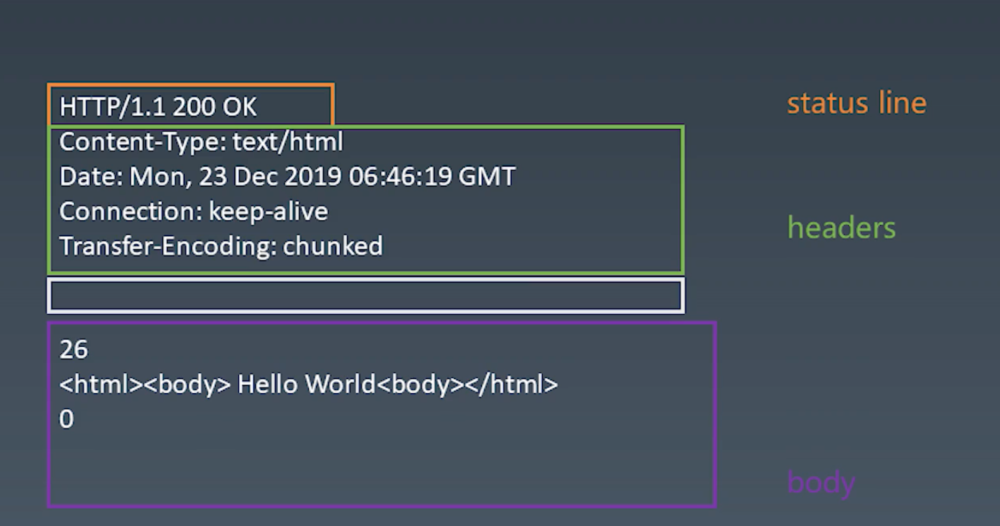
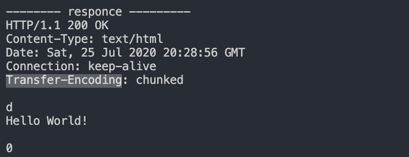
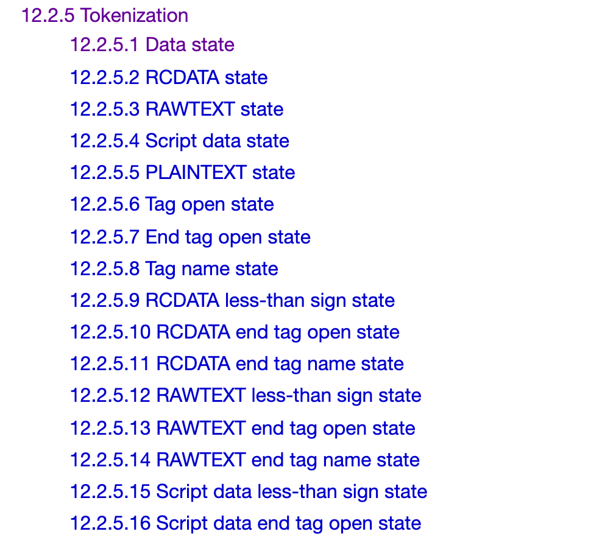
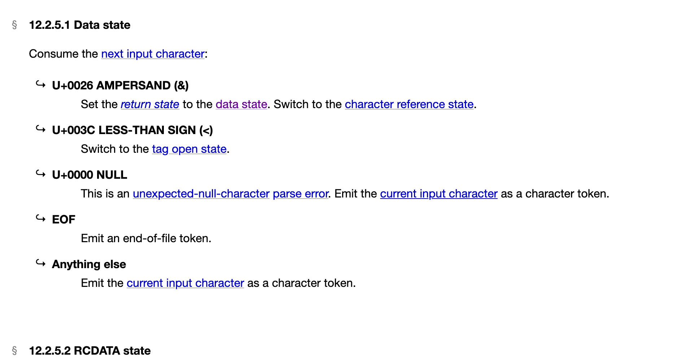

# Week04学习总结

Date: Jul 24, 2020

### telnet 客户端 安装

`brew install telnet`

- telent 是一个纯粹的 TCP 连接工具

### 模拟HTTP请求

1. 建立TCP连接

   `telnet [time.geekbang.org](http://time.geekbang.org/) 80`

2. 发起请求

   ```bash
   GET / HTTP/1.1     #request line
   Host: time.geekbang.org   
   ```

3. 按下两次回车，收到服务端回复

   ```bash
   HTTP/1.1 301 Moved Permanently   #response line 协议和版本、状态码和状态文本。
   Date: Fri, 25 Jan 2019 13:28:12 GMT
   Content-Type: text/html
   Content-Length: 182
   Connection: keep-alive
   Location: https://time.geekbang.org/
   Strict-Transport-Security: max-age=15768000
   
   <html>
   <head><title>301 Moved Permanently</title></head>
   <body bgcolor="white">
   <center><h1>301 Moved Permanently</h1></center>
   <hr><center>openresty</center>
   </body>
   </html>
   ```

### 请求头

```bash
Accept: text/html,application/xhtml+xml,application/xml;q=0.9,image/webp,image/apng,*/*;q=0.8,application/signed-exchange;v=b3;q=0.9
Accept-Encoding: gzip, deflate, br
Accept-Language: zh-CN,zh;q=0.9,en;q=0.8
Cache-Control: max-age=0
Connection: keep-alive
Cookie: sensorsdata2015jssdkcross=%7B%22distinct_id%22%3A%2216d249a5a701aa-04f168ec1e8c0d-38637501-1296000-16d249a5a76249%22%2C%22%24device_id%22%3A%2216d249a5a701aa-04f168ec1e8c0d-38637501-1296000-16d249a5a76249%22%2C%22props%22%3A%7B%22%24latest_referrer%22%3A%22%22%2C%22%24latest_referrer_host%22%3A%22%22%2C%22%24latest_traffic_source_type%22%3A%22%E7%9B%B4%E6%8E%A5%E6%B5%81%E9%87%8F%22%2C%22%24latest_search_keyword%22%3A%22%E6%9C%AA%E5%8F%96%E5%88%B0%E5%80%BC_%E7%9B%B4%E6%8E%A5%E6%89%93%E5%BC%80%22%7D%7D
Host: pay.zjtlcb.com
If-Modified-Since: Tue, 21 Jul 2020 16:39:16 GMT
If-None-Match: "5f171a34-474"
Sec-Fetch-Dest: document
Sec-Fetch-Mode: navigate
Sec-Fetch-Site: none
Sec-Fetch-User: ?1
Upgrade-Insecure-Requests: 1
User-Agent: Mozilla/5.0 (Macintosh; Intel Mac OS X 10_15_5) AppleWebKit/537.36 (KHTML, like Gecko) Chrome/83.0.4103.116 Safari/537.36
```

### 有限状态机处理字符串

1. 状态机里的每一个机器没有状态，类似于纯函数(无副作用)
2. 状态机所有机器接受的输入一致
3. 每一个状态机知道下一个状态
   - 每个机器有一个确定的下一个状态——Moore
   - 每个机器根据输入进入下一个不同状态——Mealy

```jsx
// 每一个状态都是函数
function state(input) {
	return next;  //返回下一个状态
} 

while(input) {
	state = state(input);
}
```

不使用状态机在一个字符串中找到a:

```jsx
function findCharA(str) {
    return [...str].map(char => char === "a"?char:"").join("");
}
```

不使用状态机,不使用正则表达式在一个字符串中找到ab:

```jsx
function findCharAB(str) {
    // pos记录”ab“的下标
    let pos = [];

    for(let i = 0;i < str.length-1;i ++) {
        if (str[i] === 'a' && str[i+1] === "b") {
            pos.push(i);
        }
    }

    return pos;
}
```

不使用状态机,不使用正则表达式在一个字符串中找到abcdef:

```jsx
function findCharABCDEF(str) {
    let flagA = false, flagB = false, flagC = false, 
    flagD = false, flagE = false;

    for(let c of str) {
        if (c === 'a') {
            flagA = true;
        }
        else if (flagA && c === 'b') {
            flagB = true;
            flagA = false;
        }
        else if(flagB && c === 'c') {
            flagC = true;
            flagB = false;
        }
        else if(flagC && c === 'd') {
            flagD = true;
            flagC = false;
        }
        else if(flagD && c === 'e') {
            flagE = true;
            flagD = false;
        }
        else if(flagE && c === 'f') {
            return true;
        }
        else {
            flagA = flagB = flagC = flagD = flagE = false;
        }
    }
    return false;
}
```

使用状态机处理一个字符串中找到abcdef:

```jsx
/**
 * 状态机函数
 */
function isMatch(str) {
    let state = start;
    for(let c of str) {
        state = state(c);
    }
    return state === end;
}
function start(c) {
    if (c === "a") {
        return FoundA;
    }else {
        return start;
    }
}
function FoundA(c) {
    if (c === "b") {
        return FoundC;
    }else {
        return start(c);
    }
}
function FoundC(c) {
    if (c === "c") {
        return FoundD;
    }else {
        return start(c);
    }
}
function FoundD(c) {
    if (c === "d") {
        return FoundE;
    }else {
        return start(c);
    }
}
function FoundE(c) {
    if (c === "e") {
        return FoundF;
    }else {
        return start(c);
    }
}
function FoundF(c) {
    if (c === "f") {
        return end;
    }else {
        return start(c);
    }
}
function end(c) {
    return end;
}
let cases = [
    'sdkfks',
    'abcdefss',
    'ababcdef',
    'abccabx'
];
for(let str of cases) {
    console.log(isMatch(str));
}
```

用状态机实现：字符串"abcabx"的解析

```jsx
// abcabx
function isMatch(str) {
    let state = start;
    for(let c of str) {
        state = state(c);
        // console.log(c, state);
    }
    return state === end;
}
let cases = [
    'abcabx',
    'abcbababc',
    'ababcdef',
    'abababcabxa'
];
for(let str of cases) {
    console.log(isMatch(str));
}
//初始状态 状态0
function start(c) {
    if (c === "a") {
        return State1;
    }else {
        return start;
    }
}
//状态1：“a"
function State1(c) {
    if (c === "b") {
        return State2;
    }else {
        return start(c);
    }
}
//状态2：“ab"
function State2(c) {
    if (c === "c") {
        return State3;
    }else {
        return start(c);
    }
}
//状态3：“abc"
function State3(c) {
    if (c === "a") {
        return State4;
    }else {
        return start(c);
    }
}
//状态4：“abca"
function State4(c) {
    if (c === "b") {
        return State5;
    }else {
        return State1(c);
    }
}
//状态5：“abcab"
function State5(c) {
    if (c === "x") {
        return end;
    }else {
        return State2(c);
    }
}
//状态6：“abcabx"
function end(c) {
    return end;
}
```

状态机实现kmp算法匹配任意pattern

```jsx
class kmp_state_machine{

    constructor(str) {
        this.str = str;
        this.states = new Map();
        this._end = () => {
            return this._end;
        }
    }

    // 构建失败转移数组
    _getNext(pattern) {
        let m = pattern.length;
        let next = new Array(m).fill(-1);
        for(let i = 0;i < m;i ++) {
            let j = i-1;
            while(j >= 0) {
                if (pattern[next[j]+1] === pattern[i]){
                    next[i] = next[j]+1;
                    break;
                }
                j = next[j];
            }
        }
        return next;
    }

    // 构建状态机
    _buildStatesMachines(pattern) {
        this.states = new Map();
        let m = pattern.length;
        let next = this._getNext(pattern);
        this._start = (c) => {
            if (c === pattern[0]) {
                return this.states.get(0);
            }
            return this._start;
        }
        for(let i = 0;i <= next.length-2;i ++) {
            this.states.set(i, (c) => {
                if (c == pattern[i+1]) {
                    return this.states.get(i+1);
                }
                else {
                    return next[i+1] === -1?this._start(c)
                            :this.states.get(next[i+1]+1)(c);
                }
            })
        }
        this.states.set(m-1, (c) => this._end);
    }

    search(pattern) {
        this._buildStatesMachines(pattern);
        let state = this._start;
        for (let c of this.str) {
            state = state(c);
        }
        console.log(state===this._end?`"${pattern}" is found`:`"${pattern}" is not found`);
    }
}

let model_string = "vabscabddddababcabdabcabddabcabddcabcadbddabsdfsfdfssdfs";
let ksm = new kmp_state_machine(model_string);
ksm.search("abcabddabcabdd");
ksm.search("abcabddabcsabdd");
ksm.search("abcabddabcabdddd");
ksm.search("abcabddab");

//"abcabddabcabdd" is  found
//"abcabddabcsabdd" is not found
//"abcabddabcabdddd" is not found
//"abcabddab" is  found
```

### http请求

简单node服务端程序

```jsx
const http = require('http');

const serve = http.createServer((req, res) => {
    res.write('Hello Node!');
    res.end();
})

serve.listen(3000);
console.log("serve start in port 3000");
```

http请求总结：

1. `Content-Type` 是一个必要字段，要有默认值
2. body是kv格式
3. 不同的 `Content-Type` 影响body的格式。
4. `Content-Length` 为bodyText.length， 数值不对会造成协议出错。

```jsx
const net = require('net');
class Request {
    constructor(options) {
        this.method = options.method || "GET";
        this.host = options.host;
        this.port = options.port || 80;
        this.path = options.path || "/";
        this.body = options.body || {};
        this.headers = options.headers || {};
        if (!this.headers['Content-Type']) {
            this.headers['Content-Type'] = "application/x-www-form-urlencoded";
        }
        if (this.headers['Content-Type'] === "application/x-www-form-urlencoded") {
            this.bodyText = JSON.stringify(this.body);
        }
        else if(this.headers['Content-Type'] === "application/json") {
            this.bodyText = Object.keys(this.body).map(key => `${key}=${encodeURIComponent(this.body[key])}`).join("&");
        }
        this.headers['Content-Length'] = this.bodyText.length;

        console.log(this);
    }
}
void async function() {
    let request = new Request({
        method: "POST",
        host: "127.0.0.1",
        port: "8088",
        path: "/",
        headers: {
            "Content-Type": "application/json",
            ["X-Foo2"]: "customed"
        },
        body: {
            name: "the shy"
        }
    })

    // let responsed = await request.send();

    // console.log(responsed);
}();
```

request格式：

1. 

response格式：





node默认返回的是 `chunk body` ，一个块一个块返回，第一行是一个16进制的length，后面是chunk内容。

> 例如上面👆这个例子，d 表示这个chunk的length是13，下一行是内容, `H`, `d` , `l`, `l`, `o`, `空格`, `W`, `o`, `r`, `l`, `d`, `!`, `\n`。

### dom树解析

[https://html.spec.whatwg.org/multipage/parsing.html#tokenization](https://html.spec.whatwg.org/multipage/parsing.html#tokenization)



html解析也是状态机，可以看到HTML Standard官网显示一共有80种状态机。初始状态为 `Data` 状态。



### 标签解析

标签的种类：

1. 开始标签 `<`
2. 结束标签 `< />`
3. 自封闭标签 `<meta charset="UTF-8">`

### 创建DOM树

startTag入栈，endTag出栈

### 文本节点添加到DOM树

多个节点需要合并