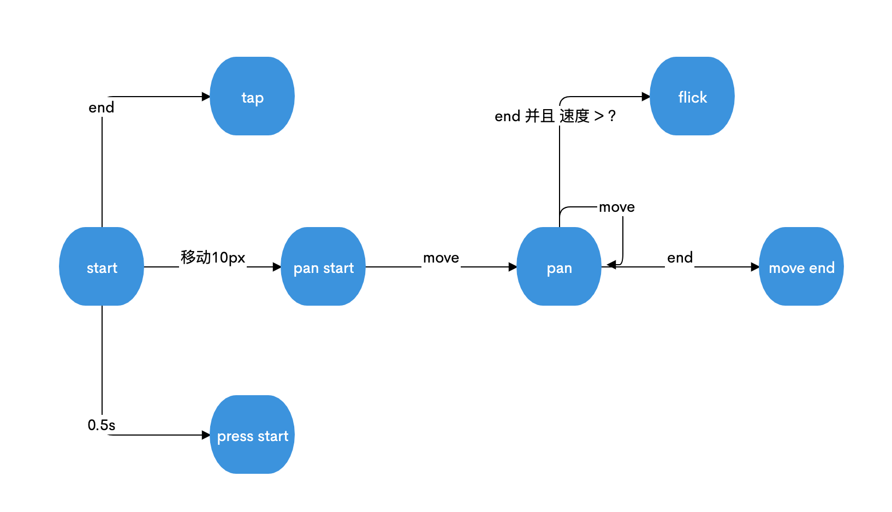
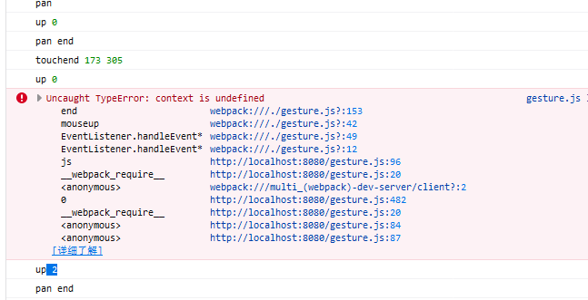

### 手势操作状态状态图

### 鼠标操作存在的问题
#### 按键和 `event.buttons` 的关系。
`0b00001`(1)代表只有左键(button=0)被点击

`0b00011`(3)代表左键和右键(button=2)同时被点击

`0b00110`(6)代表中键(button=1)和右键同时被点击

#### 多个按键同时按下
会触发多个mouseup (被绑定多次)

