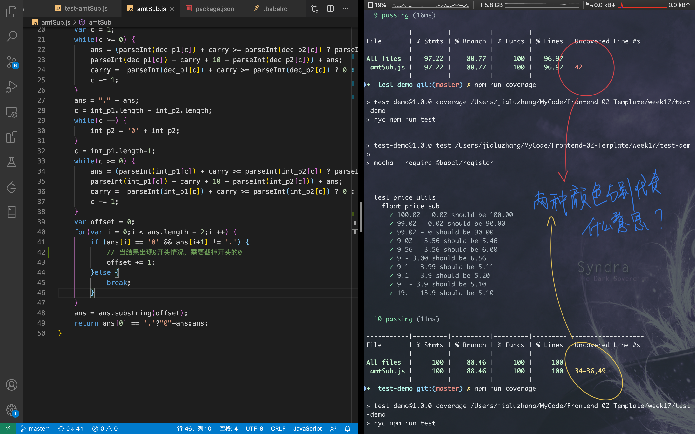

### mocha 简单使用

> 8.0以后, Mocha 需要 Node.js的版本号高于 v10.12.0

### 配置支持ES6模块

Mocha默认是一个nodejs模块，默认需要使用CommonJs模块的导入导出方式。

**test-demo/amtSub.js**

```js
// export as AMD Module
module.exports = function amtSub(amt1, amt2) {
		// TODO 
}
```

**test-demo/test/test-amtSub.js**

```js
var assert = require('assert');
const amtSub = require('../amtSub');  // import as AMD Module

describe('test price utils', function () {
    describe('float price sub', function () {
        it('100.02 - 0.02 should be 100.00', function () {
            assert.strictEqual(amtSub('100.02', '0.02'), '100.00');
        });
    });
});
```

#### 借助babel插件

+ babel/core
+ [babel/register](https://babeljs.io/docs/en/babel-register) 

```js
mocha --require @babel/register
```

### code coverage

**安装nyc**

```bash
npm i -D nyc
```

**package.json**

```diff
  "scripts": {
      "test": "mocha --require @babel/register",
+      "coverage": "nyc npm run test"
  },
```

**测试覆盖率**


测试未覆盖全，且有测试样例通不过

**修改后**



